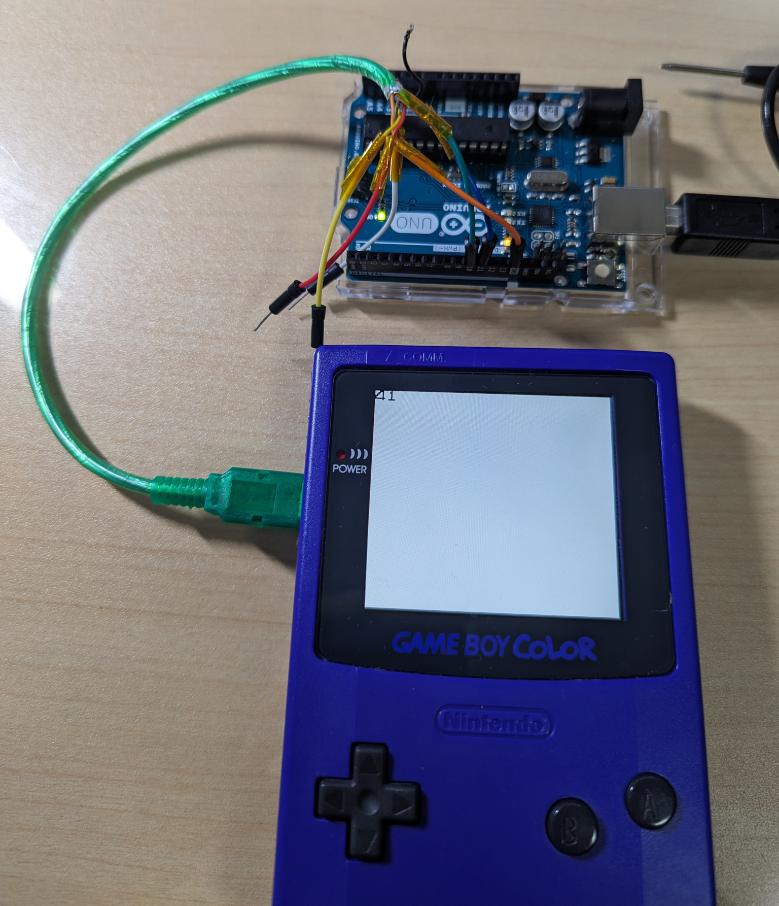

# GB Serial Test
## Overview
Game Boy serial communication test with Arduino.

Works on Game Boy Color only.

Tested with Arduino Uno R3.

## Prepare

- Connect link cable to Arduino
    - Link Port Serial Out - Arduino Pin 10
    - Link Port Serial Data - Arduino Pin 11
    - Link Port GND - Arduino GND
- Prepare Game Boy software
    - Download rs232test_20140307.zip from Reference website
    - Flash rs232test.GB onto the flash cart
- Upload the program to the Arduino

## Usage
- Arduino Serial Console
    - Send charactor code to Gameboy
    - Display received data from Game Boy
- Game Boy
    - Send 1byte data to Arduino
    - Display received data from Arduino

## Reference
- [Gameboy Programing - 通信ポートで遊ぶ -](http://mydocuments.g2.xrea.com/html/gb/comm.html)